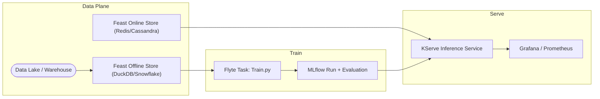

> **TL;DR** — MLOps = DevOps + ML-specific needs (data/experiment tracking, automated retraining, online serving, and continuous monitoring).  
> A pragmatic 2025 stack couples **Feast** for features, **MLflow 3.0** for experiments & registry, and an orchestrator (e.g. **Flyte** or **Kubeflow**) wrapped with standard CI/CD and observability.

## 🌐 What is MLOps?

MLOps (Machine-Learning Operations) is the engineering discipline that scales a model from a notebook to 24×7 production.
It glues **data**, **model code**, **infrastructure**, and **people** together so that:

* models are _repeatable_ (same inputs ➜ same outputs)
* releases are _automated_ (CI/CD pipelines not screenshots)
* behaviour is _observable_ (metrics, drift, feedback loops)

A 2025 survey lists **90+** active OSS & SaaS tools, grouped into feature stores, experiment trackers, orchestration, deployment, and monitoring stages.

*An end-to-end MLOps loop.*

## 🧩 Key Building Blocks & Popular Tools

| Stage | Responsibility | 2025 Favourites (OSS ▲ / Hosted ◆) |
|-------|---------------|-------------------------------------|
| **Data / Features** | Keep training & serving features consistent | ▲ **Feast**, ▲ Hopsworks, ◆ Vertex AI Feature Store |
| **Experiment Tracking** | Log params + metrics + artifacts | ▲ **MLflow 3.0**, ▲ Weights & Biases, ▲ Neptune |
| **Workflow Orchestration** | Declare pipelines, manage DAGs | ▲ Flyte, ▲ Kubeflow Pipelines, ▲ Apache Airflow |
| **CI/CD & Infra-as-Code** | Automate build, test, deploy | ▲ GitHub Actions, ▲ Terraform, ◆ AWS CodePipeline |
| **Model Serving** | Real-time / batch inference | ▲ KServe, ▲ BentoML, ◆ AWS SageMaker |
| **Observability & Drift** | Detect performance regressions | ▲ Evidently AI, ▲ Prometheus + Grafana, ◆ Arize |

### Focus tools

**Feast (Feature Store)** – provides a versioned offline store, a low-latency online store and a gRPC/HTTP feature server so the same features feed both training and inference.

*Feast bridges offline ↔ online features.*

**MLflow 3.0 (Preview)** – adds automatic experiment tracking, a richer model registry, and built-in evaluation for classic ML _and_ generative-AI workloads.

*MLflow 3.0 unifies tracking & registry.*

## 🛠️ A Minimal 2025 Stack in Practice

